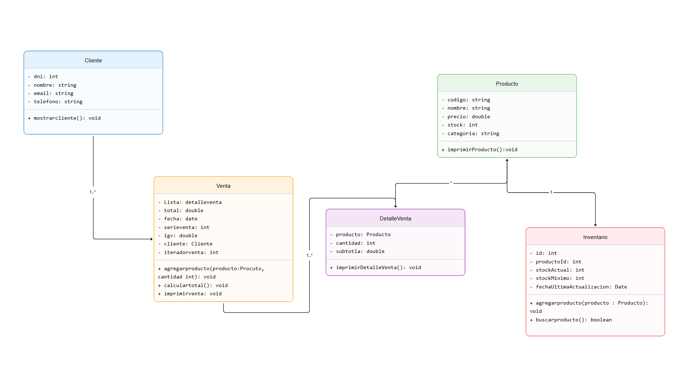

# 🛒 ventasMarket

Este es un Sistema de Ventas desarrollado para facilitar la gestión de ventas,
gestionar inventario y generar reportes de ingresos.

## 🚀 Tecnologías Utilizadas

Sistema desarrollado en java de tipo consola
 

## 📦 Características
- 
- 💳 Procesamiento de ventas y facturación
- 📊 Reportes de ventas por día/mes/año
- 📦 Control de stock e inventario

## Modelo UML del sistema

## Arquitectura del sistema 
contracts
    IInventario
    IVenta
models
    Cliente
    DetalleVenta
    Persona
    Producto
Services
    Inventario
    Venta
utils
    Parametros
    StringUtils

VentasMarket(Main)