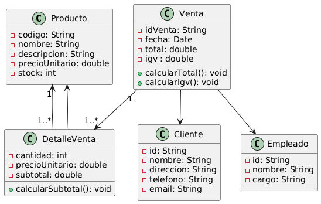

# 🛒 ventasMarket

Este es un Sistema de Ventas desarrollado para facilitar la gestión de productos, clientes, facturación y reportes en pequeños y medianos negocios.
La aplicación permite registrar ventas, gestionar inventario, controlar clientes y generar reportes de ingresos.

## 🚀 Tecnologías Utilizadas

- Backend: Java (Spring)
- Frontend: `HTML`, `CSS`, `JavaScript`, `React`
- Base de datos: PostgreSQL

## 📦 Características

- 🧾 Registro y gestión de productos
- 👤 Administración de clientes
- 💳 Procesamiento de ventas y facturación
- 📊 Reportes de ventas por día/mes/año
- 📦 Control de stock e inventario
- 🛠️ Panel de administrador

## Modelo UML del sistema

